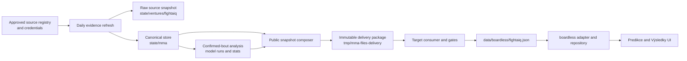

# FightAIQ end-to-end review

Reviewed 2026-08-09 against the last persisted intake and delivery from 2026-08-08. The original diagnosis below remains the evidence record; Q3, M9 and Q4 have since shipped without weakening the two-source or delivery guards. The delivered package is hash `4c8075…529a29`, and its receipt records a successful delivery to `lukaskourilcz/mma-files` at target commit `1b458898…9805bf`. [Evidence: `state/ventures/fightaiq/deliveries/4c8075f6796f9a836e0cf5bbb770ae143c119f1dd5d41563e30473eb1a529a29.json:1-8`]

## Relaunch resolution

- **Q3 (`d9f05bf..28b0434`)** repaired the source/store path: the Cito quota stayed bounded, Oktagon card fixtures now traverse the full persistence path, observed fighters can grow only inside the roster policy, and reader divisions/names are normalized without changing source identifiers.
- **M9 (`2bd96de..ee6b890`)** made delivered events authoritative, restored completed historical cards, retained legacy-division normalization at the consumer, and emits surface-specific static files instead of making reader pages import the 6.5 MB delivery store.
- **Q4 (`28b0434..f81fe57`)** pinned actor builds and charge caps, classified three candidates as disabled or blocked, left only the Tapology reference step approval-gated, and made missing approval or token a tested $0 no-op. Odds matching gained deterministic normalization and tests while the provider-count gate stayed intact.

The truthful product state is therefore improved but not embellished: 92 fighters, three UFC events, 1,085 bouts and zero prediction entries remain the last persisted delivery. Results and known cards render; prediction rows say `Model zatím neběžel`. A second current provider, confirmed eligible bouts and an actual versioned model run still depend on owner-approved source access and new evidence.

## Original finding

The empty boards are not one broken switch. The persisted store has 92 fighters, three UFC events, 1,085 bouts and no prediction entries; all 45 upcoming bouts are `announced`, while all 1,040 completed bouts are historical records. There is no Oktagon event, odds snapshot, model run or stats file in `state/mma/`. [Evidence: `state/mma/fighters/`, `state/mma/events/`, `state/mma/bouts/`, absent `state/mma/odds/`, absent `state/mma/model-runs/`, absent `state/mma/stats/`; reproduction commands in “State audit”]

The upstream blocker is source diversity. Every persisted bout reference belongs to the Wikipedia provider. The contract treats repeated Wikipedia pages as one provider and requires two independent providers before an upcoming bout may be `confirmed`; the delivery consumer repeats that guard. [Evidence: `orchestrator/src/contracts/mma.ts:13-24`, `orchestrator/src/contracts/mma.ts:197-204`, `../mma-files/scripts/consume-boardless-package.mjs:61-69`, `../mma-files/scripts/consume-boardless-package.mjs:212-226`; reproduction commands in “State audit”]

The site also had a separate failure: it discarded every `:event:history-` bout before deriving events, preferred that reduced bout list over the delivered `events[]` whenever even one current bout existed, and therefore could not render the completed history or use the three delivered cards as authoritative input. M9 removed that behavior and added target-side coverage for the delivered history. [Original evidence: pre-M9 `../mma-files/src/lib/boardless.ts:401-464`]

## Data flow



1. `config/mma-sources.json` is parsed through a schema that records coverage, state, credential, free limit and terms verdict; a source cannot be wired with an unclear or forbidden verdict. [Evidence: `orchestrator/src/fightaiq/sources.ts:9-42`, `config/mma-sources.json:1-72`]
2. `refreshFightAiQEvidence` loads that registry, reads the Odds and Cito credentials, applies their quota gates, fetches the roster and schedule, and persists a dated raw source snapshot. [Evidence: `orchestrator/src/portfolio/evidence.ts:124-178`, `orchestrator/src/portfolio/evidence.ts:180-238`, `orchestrator/src/portfolio/evidence.ts:240-288`, `orchestrator/src/portfolio/evidence.ts:292-345`]
3. The same refresh materializes reviewed records into `state/mma/fighters`, `state/mma/events`, `state/mma/bouts` and, only for matched offers, `state/mma/odds`; store loaders parse every JSON record against the canonical schemas. [Evidence: `orchestrator/src/fightaiq/intake.ts:438-499`, `orchestrator/src/fightaiq/store.ts:18-30`, `orchestrator/src/fightaiq/store.ts:62-65`, `orchestrator/src/fightaiq/store.ts:100-114`]
4. Analysis accepts only future `confirmed` or `weigh-in` bouts whose two fighters both pass the evidence-based model-eligibility gate. A successful run writes immutable `state/mma/model-runs/<hash>.json` and one `state/mma/stats/<id>.json` per prediction. [Evidence: `orchestrator/src/fightaiq/analysis.ts:23-64`, `orchestrator/src/fightaiq/analysis.ts:96-126`]
5. The delivery composer reads fighters, events, bouts and stats, converts the first three to public mirrors, excludes private odds and model-run artifacts, calculates one canonical package hash, and stages the package under `tmp/mma-files-delivery/`. [Evidence: `orchestrator/src/mma-files/publish.ts:38-86`, `orchestrator/src/mma-files/publish.ts:117-130`; private-field rejection: `../mma-files/scripts/consume-boardless-package.mjs:151-167`]
6. `cycle.yml` selects a FightAIQ package after MMA intake or analysis, mints a repository-scoped token, runs the target consumer, rejects any path beyond `data/boardless/fightaiq.json`, and requires the target tests, typecheck and production build before it may push. [Evidence: `.github/workflows/cycle.yml:1093-1113`, `.github/workflows/cycle.yml:1126-1188`, `.github/workflows/cycle.yml:1190-1246`]
7. The target consumer revalidates schemas, evidence and the package hash, rejects an older snapshot, and atomically writes only `data/boardless/fightaiq.json`. [Evidence: `../mma-files/scripts/consume-boardless-package.mjs:160-257`, `../mma-files/scripts/consume-boardless-package.mjs:469-480`]
8. The target build now emits separate predictions, results and fighters JSON files from the delivery snapshot. Its adapter keeps delivered events authoritative and divides known bouts into upcoming and completed reader surfaces without inventing missing data. [Evidence: `../mma-files/scripts/emit-fightaiq-chunks.mjs`, `../mma-files/src/lib/boardless.ts`, `../mma-files/src/lib/repository.ts`]

## Source health and cost

### Current sources

| Source | Health and coverage | Quota and cash cost | Consequence |
|---|---|---|---|
| Cito UFC API | Live for UFC fighters and upcoming event shells. The historical event-bout follow-up returned `rowCount: 0` on every recorded run. That follow-up has already been removed: current code makes one upcoming-events request and, only when a card is inside the horizon, one fighter-page request. It has no Oktagon coverage. [Evidence: `orchestrator/src/fightaiq/sources.ts:354-387`, `orchestrator/src/portfolio/evidence.ts:199-218`, `config/mma-sources.json:33-44`] | $0 cash on the 500/month, 200/day free plan. The 2026-08-08 ledger records 18 monthly calls, two daily calls and a two-call reservation. The old “three of five calls” description is historical, not the current spend. [Evidence: `config/mma-sources.json:33-44`, `state/mma/source-quota/cito.json:1-8`, `orchestrator/src/portfolio/evidence.ts:102-114`, `orchestrator/src/portfolio/evidence.ts:223-233`] | Ten returned UFC event shells still contain empty `bouts` arrays in the last raw snapshot, so Cito cannot create canonical cards by itself. [Evidence: `state/ventures/fightaiq/source-snapshots/2026-08-08.json:1722-2377`, including empty event bouts at `:2360-2375`] |
| The Odds API | Live. The last source snapshot contains 52 MMA offers and the provider reported 493 of 500 credits remaining, seven used and one charged for the last request. [Evidence: `state/ventures/fightaiq/source-snapshots/2026-08-08.json:13-1720`, `state/ventures/fightaiq/source-snapshots/quota.json:1-5`] | $0 cash while the 500-credit free allowance remains. The guard refuses a request when the stored balance is zero and refreshes the authoritative ledger from response headers. [Evidence: `config/mma-sources.json:19-30`, `orchestrator/src/fightaiq/sources.ts:91-119`, `orchestrator/src/portfolio/evidence.ts:145-174`] | The matcher found no persisted bout for the last offers, so `state/mma/odds/` is absent and no Odds provider reference reached a bout. Matching currently requires a known fighter pair, a date within seven days and a capture phase no earlier than 84 hours before the offer. [Evidence: absent `state/mma/odds/`; `orchestrator/src/fightaiq/intake.ts:353-417`; reproduction commands in “State audit”] |
| Wikimedia | Live and $0: keyless Wikipedia/Wikidata APIs cover both organizations, identity, rosters and history. It is the only provider represented on persisted bouts today, even when a bout has several Wikipedia page references. [Evidence: `config/mma-sources.json:6-16`, `orchestrator/src/contracts/mma.ts:13-24`; `state/mma/bouts/`; reproduction commands in “State audit”] | $0 cash, subject to public-API polite-use limits. The 2026-08-08 raw snapshot returned the full reviewed 92-name roster and two scheduled UFC cards. [Evidence: `config/mma-sources.json:6-16`, `state/ventures/fightaiq/source-snapshots/2026-08-08.json:2379-3142`] | It supplies history and current UFC cards, but one provider cannot satisfy confirmation. It also cannot prove active Oktagon roster status: all 12 Oktagon fighters remain `unknown`. [Evidence: `state/mma/roster/status.json:1-19`] |
| Owner-reviewed import | Wired fallback for reviewed history, results and gap filling. Every row must carry source references and pass owner review. [Evidence: `config/mma-sources.json:47-57`] | $0 local import. [Evidence: `config/mma-sources.json:47-57`] | Useful for bounded corrections, not an automated second current listing. [Evidence: `config/mma-sources.json:47-57`] |
| Official organization pages | Disabled. `oktagonmma.com` is named, but automated reading is forbidden until a written terms review changes `termsVerdict: "unclear"`; the registry would reject wiring it as-is. [Evidence: `config/mma-sources.json:60-70`, `orchestrator/src/fightaiq/sources.ts:28-36`] | $0 cash and zero runtime calls while disabled. [Evidence: `config/mma-sources.json:60-70`] | No official Oktagon event, roster or result evidence enters the store. [Evidence: `config/mma-sources.json:60-70`, absent `state/mma/events/oktagon/`] |

### Why no Oktagon event is materialized

The “2026 in Oktagon MMA parse yields nothing” diagnosis needs a narrower wording. The parser is configured for that page and its copied-live fixture proves that it can parse and date-filter Oktagon rows. [Evidence: `orchestrator/src/fightaiq/wikipedia-events.ts:105-148`, `orchestrator/src/fightaiq/wikipedia-events.ts:342-351`, `orchestrator/tests/fightaiq-wikipedia-events.test.ts:9-16`, `orchestrator/tests/fightaiq-wikipedia-events.test.ts:39-97`]

The current loss happens at the intake boundary: event gathering keeps only scheduled events within 14 days, then materializes only cards whose event page yields at least one bout. The 2026-08-08 raw schedule result contains two UFC cards and no Oktagon card, and the canonical store consequently contains only `state/mma/events/ufc/`. [Evidence: `orchestrator/src/portfolio/evidence.ts:94-121`, `orchestrator/src/portfolio/evidence.ts:265-286`, `orchestrator/src/fightaiq/wikipedia-events.ts:403-444`, `state/ventures/fightaiq/source-snapshots/2026-08-08.json:3122-3142`, `state/mma/events/ufc/`, absent `state/mma/events/oktagon/`]

A read-only reproduction with `now=2026-08-09T12:00:00Z` returned Oktagon rows from `fetchScheduledEvents`, but none was inside the 14-day intake window. Q3 consequently added a full `fetchScheduledCards → scheduledEventCard → state/mma/events/oktagon` fixture path without weakening the parser or claiming the page was unreadable. [Evidence: parser entry point `orchestrator/src/fightaiq/wikipedia-events.ts`; intake horizon `orchestrator/src/portfolio/evidence.ts`; persistence `orchestrator/src/fightaiq/intake.ts`; acceptance in `orchestrator/tests/fightaiq-wikipedia-events.test.ts`]

### Oktagon roster

The reviewed Oktagon allowlist is capped at 12 and contains exactly 12 names. Two reader-facing names still include the Wikipedia disambiguator `(fighter)`. [Evidence: `config/mma-roster.json:493-570`]

All 12 materialized records remain roster-status `unknown`, none is model eligible, and their completed history is derived from Wikipedia pages rather than a current promotion roster. [Evidence: `state/mma/roster/status.json:3-19`, `state/mma/fighters/`; reproduction commands in “State audit”]

Q3 now grows the policy only from fighters observed on delivered event cards, preserves the cap and allowlist behavior, and cleans reader names without changing Wikipedia lookup titles. [Evidence: policy enforcement `orchestrator/src/fightaiq/intake.ts`; configured titles `config/mma-roster.json`; acceptance in the FightAIQ intake tests]

## Corroboration deadlock

For fighter fields, a value becomes corroborated only when equal values carry at least two independent providers; all critical fields must also be verified and free of open discrepancies before `modelEligible` becomes true. [Evidence: `orchestrator/src/fightaiq/intake.ts:57-72`, `orchestrator/src/fightaiq/intake.ts:84-93`]

For bouts, the schema refuses `confirmed` and `weigh-in` with fewer than two independent providers. Scheduled Wikipedia cards start with one `source:wikipedia:<date>:<title>` reference; repeat reads and different Wikipedia page IDs remain one provider. [Evidence: `orchestrator/src/contracts/mma.ts:13-24`, `orchestrator/src/contracts/mma.ts:197-204`, `orchestrator/src/fightaiq/intake.ts:270-300`]

Odds intake already contains a confirmation path: a successfully matched offer appends `source:the-odds-api:<offer-id>` and promotes an announced bout when the independent-provider count reaches two. In the current state that path matched nothing, so all 45 upcoming bouts remain announced and `confirmedUpcomingBouts` is zero. [Evidence: `orchestrator/src/fightaiq/intake.ts:361-435`, absent `state/mma/odds/`, `state/mma/roster/status.json:16-19`; reproduction commands in “State audit”]

This is the deadlock: Wikipedia supplies the current card, but the Odds offers do not link to it, Cito event shells have no bouts, and the official or Apify alternatives are disabled or unapproved. The contract is correct to refuse confirmation; the missing work is independent evidence and deterministic entity matching, not a weaker guard. [Evidence: `state/ventures/fightaiq/source-snapshots/2026-08-08.json:13-1720`, `state/ventures/fightaiq/source-snapshots/2026-08-08.json:1722-2377`, `config/mma-sources.json:60-70`, `state/INBOX.md:63-82`, `orchestrator/src/contracts/mma.ts:197-204`]

## Model-run status

There is no model output. `state/mma/model-runs/` and `state/mma/stats/` do not exist, the evaluation summary records zero events and predictions with no mean Brier score, and the delivered site snapshot has `statsEntries: []`. [Evidence: absent `state/mma/model-runs/`, absent `state/mma/stats/`, `state/mma/evaluation/summary.json:1-7`, `../mma-files/data/boardless/fightaiq.json:234749-234750`]

The immediate cause is stronger than the earlier “waiting for the odds key” explanation. Analysis has 45 upcoming bouts, but none is confirmed and no upcoming pair has two model-eligible fighters; the analysis selector therefore returns no inputs and writes nothing. [Evidence: `orchestrator/src/fightaiq/analysis.ts:23-64`, `orchestrator/src/fightaiq/analysis.ts:96-115`, `state/mma/bouts/`, `state/mma/fighters/`; reproduction commands in “State audit”]

The 2026-08-08 `mma-analysis` decision is stale when it says it is waiting for the key: the same day’s source snapshot proves the Odds API ran successfully with 493 credits remaining. The real remaining blockers are matching, corroboration and fighter eligibility. [Evidence: `state/decisions/20260808170318-mma-analysis.json:1-10`, `state/ventures/fightaiq/source-snapshots/2026-08-08.json:13-17`, `state/ventures/fightaiq/source-snapshots/2026-08-08.json:1714-1720`, `orchestrator/src/fightaiq/analysis.ts:52-64`]

The site does not invent a fallback probability. It renders percentages only for a finite, normalized model line with a version and capture timestamp; otherwise each known bout says `Model zatím neběžel`. [Evidence: `../mma-files/src/components/fightaiq/BoutRow.tsx:36-48`, `../mma-files/src/components/fightaiq/BoutRow.tsx:77-123`, `../mma-files/src/i18n/cs.ts:388-404`]

## Quota ledgers and approval state

| Ledger | Persisted state | Guard |
|---|---|---|
| Cito | 18/500 monthly calls and 2/200 daily calls on 2026-08-08; two calls reserved per run. [Evidence: `state/mma/source-quota/cito.json:1-8`, `config/mma-sources.json:33-44`] | A run is refused before requests if its reservation would cross either cap. [Evidence: `orchestrator/src/portfolio/evidence.ts:102-114`, `orchestrator/src/portfolio/evidence.ts:180-197`] |
| Odds | 493/500 credits remain; the last call cost one. [Evidence: `state/ventures/fightaiq/source-snapshots/quota.json:1-5`, `state/ventures/fightaiq/source-snapshots/2026-08-08.json:1714-1720`] | A stored zero balance skips the fetch; response headers replace the stored balance after a successful call. [Evidence: `orchestrator/src/fightaiq/sources.ts:91-119`, `orchestrator/src/portfolio/evidence.ts:145-174`] |
| Apify | The MMA ledger exists at zero use with a hard $3 share, but no actor may run: both `APIFY-ACCOUNT-001` and `APIFY-MMA-SOURCES-001` remain pending. [Evidence: `state/mma/source-quota/apify.json`; `state/INBOX.md:8-31`, `state/INBOX.md:63-82`] | Four cumulative stops now apply: both owner approvals plus token, the provider-reported shared $5 Free-plan credit, the $3 MMA share with a $0.75 reservation, and an actor-specific maximum charge. The pending-approval path makes no provider usage request and writes no quota file. [Evidence: `orchestrator/src/sources/apify.ts`; `orchestrator/tests/goviral.test.ts`] |

The MMA Apify path has $0 cash authority. Q4 replaced the broad estimate with pinned actor builds and conservative row/run caps. Only the Tapology promotion reader passed the terms review, and even it remains approval-gated; the other candidates are disabled or blocked rather than treated as available evidence. [Evidence: `config/mma-sources.json`; guard and pricing schemas in `orchestrator/src/sources/apify.ts`]

### Q4 pinned actor credit plan

| Candidate | Pinned build and pricing | Maximum planned credit burn | Terms/runtime state |
|---|---|---|---|
| UFCStats | `parseforge/ufc-stats-scraper` build `ZylLcaS4oLYgWYyuE`; $0.021 per result; 10-result/$0.21 run cap | $0.42/month at twice monthly | Disabled. UFC terms prohibit automated page scraping and no separate ufcstats.com permission was found. |
| ESPN MMA | `scrapesage/espn-sports-scraper` build `pwb8idlTe8EZJjCL4`; $0.003 per game; 30-game/$0.09 run cap | $0.36/month at weekly cadence | Disabled. The public JSON endpoint has no reviewed commercial reuse license. |
| Tapology Oktagon | `apify/cheerio-scraper` build `gTZUgxTMzuh0BBr4b`; platform usage capped at $0.05 for one promotion page | $0.20/month at weekly cadence | Proposed and approval-gated. Restricted to reference use of promotion/card facts; rankings, login and training use are excluded. |
| Sherdog profiles | `richard.biros/sherdog-profile-scraper` build `ApIt4NFasPSVvEhk6`; $0.001 per result; nominal 20-result cap | $0/month | Blocked. Sherdog terms conflict with collating profile content elsewhere. |

The runnable plan therefore reserves at most $0.75 but currently has only a $0.05 Tapology step. Disabled and blocked actors do not consume that reservation. Actor Store prices are recorded beside their Store evidence URLs in `config/mma-sources.json`; any price or build change requires a registry update before a run. The Odds API remains a separate $0 source with its authoritative 500-credit ledger and does not consume Apify credit.

## Editorial effect of the 2026-08-08 VETO

The mag desk vetoed more FightAIQ and PM work because the only allowed subject was the same already-published card; it allowed AM only as an audit against a new source. [Evidence: `state/decisions/20260808180102-mag-desk.json:1-14`]

The root-cause link to data scarcity is an inference, but a direct one: the store offers only three UFC cards, 45 unconfirmed upcoming bouts, no Oktagon event and no prediction entry, so the desk cannot form a materially new sourced angle without another source or card. [Evidence: `state/mma/events/ufc/`, absent `state/mma/events/oktagon/`, `state/mma/bouts/`, absent `state/mma/stats/`; reproduction commands in “State audit”]

## Resolution record

1. **Q3 — completed.** Canonical events and identities are tested through persistence, roster growth remains bounded, and quota limits are unchanged.
2. **M9 — completed.** The target renders the evidence it already has, including historical results, through slim surface files.
3. **Q4 — code completed; source access pending.** Terms, builds, caps, matching and the $0 no-op are implemented. `APIFY-ACCOUNT-001` and `APIFY-MMA-SOURCES-001` remain owner decisions, and no actor runs before both are resolved.

This preserves the ordering invariant: trustworthy canonical records first, truthful rendering second, and independent corroboration only after approval and evidence. No release guard was loosened to make a board look full.

## State audit

These read-only commands reproduce the numerical claims from the persisted 2026-08-08 state. They do not call a source or write a file. [Evidence: inputs under `state/mma/` and `state/ventures/fightaiq/source-snapshots/2026-08-08.json`]

```sh
# Store inventory.
find state/mma/fighters -type f -name '*.json' | wc -l
find state/mma/events -type f -name '*.json' | wc -l
find state/mma/bouts -type f -name '*.json' | wc -l
find state/mma/stats -type f -name '*.json' 2>/dev/null | wc -l
find state/mma/odds -type f -name '*.json' 2>/dev/null | wc -l

# Organization, status, eligibility and provider counts.
jq -s 'group_by(.org) | map({org: .[0].org, count: length})' state/mma/fighters/*.json
jq -s 'group_by(.org) | map({org: .[0].org, count: length})' state/mma/events/*/*.json
jq -s 'group_by(.status) | map({status: .[0].status, count: length})' state/mma/bouts/*/*.json
jq -s '[.[] | select(.modelEligible)] | group_by(.org) | map({org: .[0].org, count: length})' state/mma/fighters/*.json
jq -s '[.[].sourceRefs[]] | map(if startswith("source:wikipedia:") then "wikipedia" else . end) | unique' state/mma/bouts/*/*.json

# Last raw-source counts and quota.
jq '.sources | map({sourceId, status, items: (.items | length), quota})' \
  state/ventures/fightaiq/source-snapshots/2026-08-08.json
```

The outputs are: 92 fighters (80 UFC, 12 Oktagon), three events (all UFC), 1,085 bouts (1,040 completed, 45 announced), 12 model-eligible fighters (all UFC), zero stats and odds files, and `wikipedia` as the only bout provider. [Evidence: `state/mma/fighters/`, `state/mma/events/ufc/`, absent `state/mma/events/oktagon/`, `state/mma/bouts/`, absent `state/mma/stats/`, absent `state/mma/odds/`; commands above]
